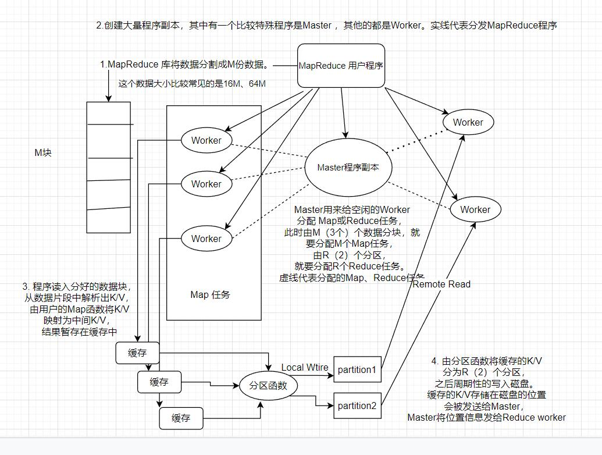

# MapReduce

​	MapReduce是一个编程模型，即使是没有分布式开发经验的编程人员也可以轻易的使用。MapReduce的由两个阶段组成—— Map->Reduce。

## 一、介绍

##### 分布式关心的问题

​	人类每天生活所产生的数据量非常庞大，需要处理PB、EB级别的数据，显然用单个的机器是难以支撑的。分布式的计算处理由此诞生，分布式解决的问题就是大规模集群对大数据的分布式并行处理。分布式所关心的问题是：

- 并行计算
- 分发数据：向各个节点发送需要处理的数据
- 容错：节点故障怎么处理
- 负载均衡：充分的利用集群资源

##### MapReduce的基本原理

​	用户实现一个Map接口和一个Reduce接口，来定义Map和Reduce任务：

1. Map从输入数据中分离出K/V对，将K/V转化为中间K/V
2. Reduce从中间K/V读取，此时V已经是具有相同K的一系列值，对这样的K/V进行处理得到最终输出结果

​	MapReduce 模型自带的“再次执行”实现了初级容灾方案。

## 二、编程模型

##### K/V类型

​	(K1/V1) -> Map -> （K2/V2）->(K2/Collection(V2))->Reduce->(K3/V3)

## 三、实现 （经裁剪的适合集群计算环境的MapReduce的实现）

### 1. 执行概述

​	第五步：Reduce收到Master发来的大小和位置信息后，使用RPC远程的从数据所在的位置读取取过来。Reduce Worker读取完中间数据后，将具有相同K的V聚合在一起，形成(K2,Collection(V2))。由于许多不同的Key会被映射到相同的Reduce任务上，因此必须进行排序。（内存够用则内部排序，不够用则外部排序）

​	第六步：Reduce Worker程序<u>**遍历排序**</u>完整个中间数据后，对于具有相同K的Collection(V)连同K会被一起交给用户定义的Reduce任务进行处理，Reduce任务的输出被追加到所属分区的输出文件。

​	第七步：当所有的Map和Reduce任务都执行完成，Master唤醒用户程序。这个时候，在用户程序里的对MapReduce 的调用才返回。

​	一般地，最终的输出被分为几个分区文件，我们不需要将其合并，更多是将他作为另一个MapReduce程序的输入。

### 2. Master数据结构

- Master存储这Map和Reduce任务的状态（空闲、工作、完成），以及机器（非空闲任务）的标识。
- Master像一个数据管道，Map处理后中间数据的大小和位置信息会被发送给Master，Map任务完成时，由Master将这些信息逐步推给正在运行的Reduce任务

### 3. 容错

##### worker故障

​	心跳机制：Master会定时的ping每个worker（机器），若规定时间未收到回复，则Master标记此worker**<u>Failed</u>**。因此

- 在Failed Worker上**完成**的Map任务，会被重置为空闲，Map任务会被重新调度给其他Worker执行。
- 在Failed Worker上**<u>运行</u>**的Map或Reduce任务，也会被置为空闲，等待重新调度

​	对于Failed Worker上的<u>**已经执行完的任务**</u>是否需要重新执行：对于已经完成Map任务的Failed Worker，由于已经不能访问，所以只能重新调度Map任务。已经完成的Reduce任务，输出已经存储在全局文件系统上，不用重新执行。

​	对于由于Failed Worker而重新调度的任务，由于他的Worker已经发生了变化，因此中间数据存储位置也就变了，必须通知给Reduce Worker，那些还没有从Failed Worker上读取的数据的Reduce，将从新的Worker上读取数据

​	对于某段时间，大规模的机器（Worker ）被标记了Failed，Master只需要简单的再次执行那些不可访问的Worker即可

##### Master失败

​	Master失败的一个解决方案是：将Master数据结构（上面的信息）写入磁盘，即检查点（checkpoint），如果这个master任务失败了，就重启一个Master任务读取检查点。实际是，只有一个Master进程，失效了只能终止MapReduce进程，交给用户处理。

##### 失效方面的处理机制

​	Map和Reduce操作是输入确定性的函数—— 只有无故障的按顺序完成，总会得到同样的输出。

​	Map和Reduce任务的输出是原子性的。每个任务都会将他们输出写入私有的临时文件。每个Reduce会生成一个这样的文件，每个Map会生成R个这样的文件。

- 一个Map任务完成时，会给Master发送R个临时文件的名字的完成信息（如果已经收到过了就忽略），Master收到这个信息就会将R个临时文件信息写入数据结构。
- Reduce任务完成时，Reduce Worker会将临时文件原子的重命名为最终文件。如果这个Reduce任务在多个机器上运行，最终的文件重命名会依赖OS的重命名的原子性来保证最终的输出文件只有一个Reduce产生的数据。

​	

### 4. 数据本地存储

​	网络资源相对磁盘资源和内存资源更加匮乏，如果集群使用网络进行大量的数据交互，不仅会造成效率低下，还会是网络资源紧张。因此：

- 将输入数据存储在本地磁盘上来节省带宽。默认的，每个数据块128MB，副本有3份
- Master的任务调度会尽量将Map任务分配给数据所在的节点上，如果不能做到，也可以将Map分配给离数据存储节点的附近节点。

​	当有一个足够大规模的集群时，运行MapReduce程序，集群中有大量的Map任务，大部分的Map任务都可以被分配给数据存储所在的节点。	

### 5. 任务粒度

​	任务粒度的划分有利于提高集群的资源利用率，能有效地进行动态负载均衡。

- 理想情况下：M和R任务要比节点数多得多，这样有利于上面的两点，同时也能提高故障恢复速度：失效的大量任务都可以被分配到其他节点上执行
- 实际上：M和R的数量划分有一定的客观限制—— Master要执行O(M+R)次调度，记录O(M*R)个状态（每个M都会产生R个分区，供R个Reduce任务使用，但是记录这个状态对内存的开销很小）
- 通常R有用户指定，因为每个R都会产生一个相应的输出文件。实际使用中，我们更倾向选择合适的M值，让每个Map任务都能处理相当于一个块大小的数据，这样上面的**<u>数据本地存储</u>**优化才最为有效。R一般设置为我们需要的节点数的较小倍数，比如2000 workers 可以设置5000 R

### 6. 备用任务

​	由于在任务执行过程中，可能出现某些原因，导致任务执行速度比正常时低很多（例如数据校验，磁盘忙碌），这个时候整个任务的执行时间都会被这个任务所拖累，这个任务被称为“Straggler”，当一个MapReduce接近完成时，Master调用备用任务将剩余的任务执行完，最终，无论是备用任务还是原来的任务将任务执行完，这个MapReduce都已经全部执行完成。这种调优机制，仅仅增加了几个百分点的资源开销，却能极大的避免“Straggler”带来的影响。

## 四、技巧 （MapReduce的一些编程技巧\扩展功能）

### 1. 分区函数

​	为了提升效率，将Map任务的输出在本机上先做分区，一般，有一个缺省的hash函数（hash(key) ）将具有相同key的value聚合在一起，就将本地各分区的数据处理为(K,Collection(V))，Hash函数将分区划分的极为均衡。

### 2. 顺序保证

​	中间K/V的处理是按增量顺序处理，保证了各个输出分区的内部有序性

### 3. Combiner函数

​	Map的中间输出有可能有很多Key相同的对，这样在Reduce聚合的过程之前Reduce用RPC远程拉取数据时可能会产生大量的网络IO，如果提前将这些Key相同的值聚合在一起，就可以减少一些网络IO。Combiner的父类是Reducer，也就是说Combiner其实是一个小型的Reducer

### 4. 输入和输出的类型

​	输入数据的解析可以由用户自定义。默认的输入可以是：

- 一行中，key代表开始字符的偏移量，value代表一行的数据
- 输入数据还可以是以key进行排序的key/value对

​	如果想要自定义输入类型，可以实现Reader接口。Reader不一定要从文件中读取数据，还可以从数据库中、内存中读取数据

​	类似的输出也可以是不同的类型，比如写入数据库，输出为Json数据格式……

​	自定义输入需要实现`RecordReader`接口，自定义输出需要实现`RecordWriter`接口

### 5. 副作用

​	通常情况，我们将输出保存为一个临时文件，然后原子的重命名这个文件。但是如果对于输出文件是多个，又要保证多文件操作的原子性，这目前是做不到的。

### 6. 跳过损坏的记录

​	在处理record时，用户程序或者是第三方库中可能存在Bug，使MR程序无法按预期执行。找出这种Bug有时很困难，MR提供了一种运行机制：

- 每个Worker都设置了signal handler用于捕获段异常和总线错误
- 在执行Map和Reduce之前，MR会将record的序号保存在全局变量中
- 在执行过程中，如果用户程序触发了一个signal，消息处理函数通过UDP将最后一条的record记录的序号发给master，master发现某个record失败超过1次以上，就跳过对这条record的处理

### 7. 本地执行

​	

### 8. 状态信息

​	Master使用Jetty服务器记录显示Job的状态信息

### 9. 计数器

​	MR库通过使用计数器来记录不同的事件发生的次数。