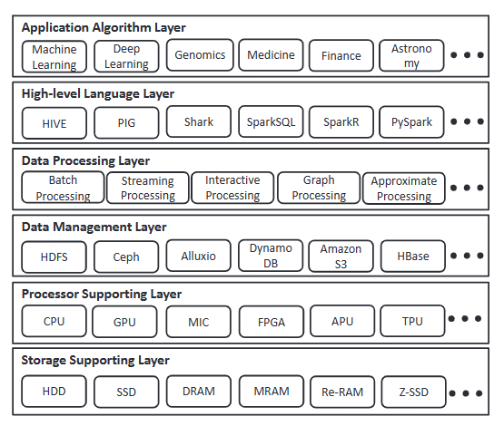
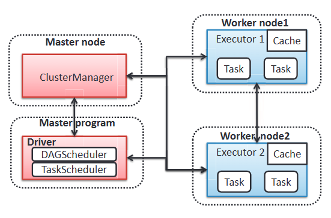
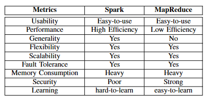
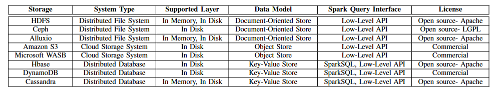

# Spark生态系统概览

## 摘要

本文是对Spark的各种优化技术的简介，包含对通用性和性能的改进。讨论了Spark的优缺点、介绍Spark支持的算法、Spark实现的各种数据管理、处理系统、机器学习算法和应用。最后讨论Spark大规模数据处理面临的开放问题和挑战。

## 1. Introduction

Spark默认不支持GPU、FPGA的新兴异构计算平台。

为了使Spark更通用和快速，已经进行了大量的工作进行优化：

- RDMA技术的应用(远程内存直接访问)
- 优化shuffle阶段
- GraphX 图像处理
- Sparrow：分布式、低延迟调度
- 数据感知集群调度中的选举权
- 将Spark扩展到更复杂的算法和应用程序

本文将对Spark的研究分为六个层次：

从最底层向上依次是：

- 存储的支持
- 处理器的支持
- 数据管理层支持
- 数据处理层支持
- 高级语言层
- 应用算法层

本文的目的有两个：

1. 寻求对Spark生态系统最新的研究调查：首先对Spark上的优化策略进行分类，以作为用户解决问题的指南。
2. 展示和探讨发展趋势、新需求与挑战，为研究人员提供潜在的研究问题和方向。

文章的布局为：第二节介绍Spark编程模型、运行时计算引擎、优缺点以及各种优化技术；第三节介绍内存计算的新缓存设备；第四节介绍利用新的加速器提高性能；第五节为数据管理；第六节为Spark支持的处理系统；第七节显式Spark支持的语言；第八节为Spark支持的机器学习库和系统、基于Spark的深度学习系统以及应用Spark系统的主要应用程序；第九节为讨论Spark中具有挑战性的问题。

## 2. Spark 核心技术

本节介绍Spark RDD编程模型，Spark框架的整体架构。接下来展示Spark的各种优缺点。

### 2.1 RDD

参考Spark-RDD

### 2.2 Spark 架构

对于每个Spark应用程序，Spark都会为其生成一个Driver的主进程，该进程负责任务调度。它遵循具有Job、Stages、Task的分层调度过程，Stages是指从相互依赖的job中分离出来的较小的任务集(map、filter、groupByKey操作)，类似于MapReduce的两个阶段。Driver里有两个调度器，分别是DAGScheduler和TaskScheduler，DAGS为作业计算阶段的DAG，跟踪具体化的RDD以及Stage的输出，TaskS是一个低级调度程序，负责从每个阶段获取任务并将其提交到集群以供执行。

Spark提供了三种集群模式（yarn、Mesos、Standalone）来运行应用程序，允许Driver连接到一个现有的集群管理器之一。在每个Worker节点中，有一个被每个应用程序创建的被称为"executor"的从属进程，它负责执行任务和将数据缓存在内存或磁盘中。

### 2.3 Spark 优缺点

本节以MapReduce作为对比，讲述Spark的优缺点。

##### 2.3.1 健壮性

- 易用性：多种易用性的、类似Stream的操作方式，例如map\reduce\reduceByKey\filter……
- 比MapReduce更快：基于内存的计算比MapReduce快10-100倍
- 更通用的计算支持：batch、interactive、iterative、streaming process。复杂的DAG调度执行引擎，广泛的应用程序和高级的API以及工具堆栈（Shark、SparkSQL、MLlib、Graphx）
- 灵活的执行支持：支持运行在Yarn、Mesos、独立部署模型。支持多种数据源的访问，包括HDFS、Tachyon、Hbase、Cassandra、AmazonS3

##### 2.3.2 弱势点

与MapReduce比起来仍有不足之处：

- Spark存储资源消耗大，Spark牺牲空间换时间。因为计算过程将大量的RDD存储在内存中
- Spark的安全性差：Spark通过共享Secret，而Hadoop有Knox、Sentry、Ranger等解决方案。Knox提供Hadoop的安全REST API和授权，Sentry、Ranger提供对Hadoop数据和元数据的访问控制和授权。
- Spark API更为复杂

##### 2.3.3 对比

相比之下：Spark API更为复杂，MR使用更简单。Spark性能更高，同时具有较高的通用性、灵活性、扩展性、容错性。他们对内存的消耗都比较大。在安全性方面Spark不如MR，Spark也比较难学习。

### 2.4 Spark 系统优化

性能是Spark最关心的问题，在此问题上有很多对Spark的性能优化的方案。

##### 2.4.1 调度优化

当前Spark中，有一个集中式调度器，他根据一些策略(例如FIFO、Fair)，将可用资源分配给处理的任务。这种调度模式不能完全满足当前数据分析的需求。在本节中，我们描述了不同类型的调度器，它们分别针对大规模分布式调度、近似查询处理、瞬时资源分配和Geo分布式设置进行了优化。

**去中心化调度**

随着任务的增加，对于吞吐量和可用性，在当前的集中式调度不能提供低延迟和高可用性。去中心化的需要没有集中状态的设计，以此来提供更高的扩展性和可用性。

案例：Sparrow——一个基于Spark的去中心化任务调度策略。Sparrow提供了基于负载均衡技术的二选择任务调度，这种策略会探测两个随机服务器，并将任务放在负载较小的服务器上。借助三种技术，Sparrow可以使用这种策略有效的发挥并行性，这三种技术分别是：批量采样、后期绑定、策略和约束；其中，批量采样减少任务的响应时间（取决于最后一个任务完成时间），以批处理方式处理一个作业的任务，取代对每个作业的任务单独取样。!TODO()

**数据感知任务调度**

对于机器学习和基于抽样的近似查询处理系统来说，可以使用数据的任何子集来计算结果，而不影响程序的正确性。目前，调度器要求应用程序静态的选择一个调度器执行任务的数据子集，避免了调度程序在运行时利用数据集的组合选择

案例：KMN，!TODO()

**瞬时任务调度**

对于云服务器来说，由于种种原因，资源利用率往往偏低，所以提高利用率是一个问题。一种解决方案是在资源未充分利用时运行不敏感的批处理作业工作负载来辅助后台任务，并在服务器需要更多资源时将其驱逐。由于级联重新计算的成本过高，Spark这种情况下往往表现不佳。

案例：TR-Spark

**Geo-分布式环境调度**

地理分布的数据中心在全球部署以提供他们的用户以低延迟访问服务。 在地理分布与 DC 内部网络相比，WAN 链路的带宽相对较低且异构。 当前数据中心内分析的查询响应时间框架在地理分布式环境中变得极高。

案例：Iridium

##### 2.4.2 内存优化

针对Spark的内存优化起因是垃圾回收型语言的缺陷——GC Stop World。

在Worker节点工作时，会相互传递数据，没有等到需要的数据，就不能执行，GC可能会导致延迟敏感性应用程序等待时间过长。如果有一个节点陷入GC，可能需要很多节点等待。因此为了协调GC，提出了Holistic Runtime System来管理跨节点的GC。这种整体 GC 系统不是独立地做出有关 GC 的决策，而是允许运行时通过三种方法做出全局协调的共识决策。首先，它让应用程序选择最合适的 GC 策略来匹配不同应用程序的需求（例如，吞吐量与暂停时间）。其次，整体系统通过考虑应用程序级优化来执行 GC。第三，GC 系统在运行时动态重新配置以适应系统变化。

此外，Spark还尝试自行管理内存（通过Unsafe API），它利用了堆外内存，可以类似C/C++那样手动的申请、释放内存，可以做到直接消除GC的影响；其次，它提出了cache-obvious算法和数据结构来开发内存层次结构；第三，它使用代码生成来避免JVM上表达式评估的开销（例如：过多的虚函数的调用，大量内存访问，无法利用现代CPU功能）；最后Spark 通过集成现代并行数据库领域中提出的技术进一步优化了其性能。

##### 2.4.3 IO优化

网络IO和磁盘IO是优化的重点，优化的方法有引入数据压缩和新型硬件

**数据压缩和共享**

Spark只支持应用程序内的内存数据共享，不支持来自多个任务的内存数据共享。Tachyon被用来作为分布式内存文件系统，达成上述情况的需求。并且，为了使更多的数据能够在内存中存储，Tachyon中提出并实现了Succinct的分布式数据存储系统，它会压缩存储数据，查询可以直接在输入数据的压缩上表示执行，避免解压缩。

**Data Shuffle**

很多需要Shuffle的操作需要大量的网络IO。由于Shuffle阶段需要大量的磁盘IO操作，为了解决这个问题，提出了Riffle框架，它通过将shuffle阶段产生的大量文件碎片整合为更大的文件块，来提高IO效率，并将小型和随机的磁盘IO转换为大型和顺序的磁盘IO操作。

还有两种优化shuffle性能的方法：C-Store面向列的DBMS，将列压缩技术应用与Spark的shuffle阶段，以此将一些负担从网络和磁盘卸载到CPU。此外他们观察到Spark在map、reduce阶段会产生大量小尺寸的shuffle文件，这给操作系统的文件管理带来了沉重的负担，从而提出一种给shuffle文件合并的方法，以减少每台机器上的shuffle文件数量。

此外，预取是一种通过重叠数据传输和shuffle阶段来隐藏shuffle成本的有效技术。当前的技术是：从何处获取及从何处获取多少数据，导致性能较低和过度的内存使用。《leveraging adaptive i/o to optimize collective data shuffling patterns for big data analytics》提出了一种独创的自适应shuffle数据传输策略通过动态调整预取以适应计算。

也有一些工作专注于在特定情况下优化混洗。金等人。 [101] 考虑了大内存服务器下 Spark 的 I/O 优化。它可以通过用大型共享内存方法替换现有的基于 TCP/IP 的混洗来实现更好的数据混洗和中间存储。与通过网络传输数据相比，通过引用全局共享内存可以显着降低map和reduce任务的通信成本。刘等人。 [113] 研究了广域网中的数据混洗，其中数据传输发生在地理分布的数据中心之间。它通过战略性和主动地将地图任务的输出数据聚合到工作数据中心的子集，设计并实现了一个基于数据聚合的 spark 系统，它取代了跨数据中心的 Spark 中使用的原始被动获取机制。它可以避免重复的数据传输，从而提高数据中心间链路的利用率。

**RDMA**

远程内存直接访问

##### 2.4.4 Provence支持

## 3. 存储支持

新型的SSD和NVM硬盘比机械硬盘有着更高的吞吐量

## 4. 处理器支持

GPU和FPGA的支持

### 4.1 GPGPU

GPU更擅长计算，而Spark本身并不能直接利用GPU加速其任务，有几个相关的内容是对这个空缺的优化：

**HeteroSpark**

它使用了GPU加速机器学习应用程序，这种对GPU的支持无需程序员掌握任何GPU的知识。

**Vispark** ：VRDD

**Exploring GPU Acceleration of Apache Spark.**

它将Spark的非Shuffle任务放在GPU上。结果表明K-Means聚类性能显著提升。

**Columnar RDD**

将内部数据存储在列式RDD中，与传统行优先的RDD相比，因为列式布局更容易使用GPU和支持SIMD的CPU中获益。（逻辑回归性能提高了3.15倍）

### 4.2 FPGA 现场可编程门阵列

**FPGA-enabled Spark**

将FPGA集成到Spark

**Blaze**

利用异构集群中的加速器（GPU、FPGA）来加速计算任务

## 5. 数据管理

大数据时代，数据通常分布在分布式文件系统或数据库中存储和管理，Spark使用的数据存储和管理系统有哪些呢？

### 5.1 DFS

**HDFS**

参见GFS paper

**Ceph**

**Alluxio**

### 5.2 云存储

**Amazon Simple Storage Service **

**Microsoft Azure Blob Storage**

### 5.3 分布式数据库系统

**Hbase**

**Dynamo**

**DynamoDB**

**Cassandra**

### 5.4 比较

## 6. 数据处理

### 6.1 Streaming Processing

### 6.2 Graph Processing

### 6.3 OLTP、OLAP Queries Processing

### 6.4 Approximate Processing

## 7. 高级语言

## 8. 应用层

## 9. 面临的问题和挑战

### 9.1 内存资源管理

Spark的性能对齐内存配置和JVM的使用很敏感。内存资源分为两种，一种用于RDD缓存，一种用于任务的工作缓存，用于存储在任务执行期间创建的对象。

- 两种内存分配的正确配置对于性能改进来说是非常重要的。
- 当缓存的RDD大量流失时，或缓存的RDD与任务的工作内存之间严重干扰时，JVM的GC可能会成为一个问题。Maas等人详细的研究了GC在分布式环境对Spark的影响。因此适当调整GC在性能优化中起着重要作用。

这个问题还处于早期阶段，没有很好的Spark解决方案。因此Spark的内存资源管理和GC调优是一个重要的问题。

Spark启动了一个Tungsten的Spark新项目，该项目将Spark的内存管理作为其首要关注的问题。

### 9.2 新型处理器的支持

除了GPU和FPGA外，新型的APU、TPU可以为提高Spark系统性能带来新的机会。

### 9.3 异构加速器支持

除了新型处理器之外，Spark集群可能由很多不同的处理器组成，不同的加速器有不同的使用方式，这种异构加速器的资源使用是一个新的问题。

### 9.4 RDD操作和共享

当前Spark的RDD有几个未解决的问题：

- RDD只支持粗粒度的操作，而不支持细粒度的操作
- 当前的RDD是不可变的，任何更新操作都会生成新的RDD，可能会造成一些数据的冗余，从而导致存储资源的浪费
- 对于RDD，其数据分区可能是倾斜的，会造成节点工作状态的过度繁忙和空闲
- Spark的应用程序只支持内部数据共享，而不支持应用程序之间的内存共享（这对节省内存资源很有帮助）

### 9.5 容错

当前RDD的容错机制是良好的，它用lineage实现故障时执行重计算，但是这建立在两个假设基础上：

- lineage信息完好保存
- driver 不会停止运行

因此Spark的容错机制并不是完美的

## 参考文献

### 应用类

- 106
- 131
- 137

### 类似框架

- MapReduce [83]
- Flink [1]
- Storm [14] 
- Dryad [96]
- Caffe [97]
- Tensorflow [62]
- Spark [148]

### Spark缺陷

- [114], [61],[89], [109]
- complex scheduling strategies [129], [141]
- high-level declarative [145], [23], [121]
- procedural languages [54],[49]

### Spark 相关生态

- 10-100 faster than MapReduce in batch processing [13]
- Shark [145], Spark SQL [121], MLlib and Graphx [89]
-  Tachyon [109], HBase,Cassandra [105], and Amazon S3 [21].
- Memcached [126], [150] and Redis [74], 
- authentication： Spark shared secret [12],hadoop：Knox [10],Sentry [16], Ranger [11]

### Spark 优化

**任务调度**

- Sparrow [129] 
- KMN [141]
- TR-Spark (Transient Resource Spark) [146]
- Iridium [130]
-  [93] designed and implemented a new task scheduling algorithm

**内存**

-  Holistic Runtime System [116], [115]
- Tungsten [4]
- Modern parallel database area [124]
- the code generation at runtime [2]

**io**

- Tachyon [109],[110]
-  Zhang et al. [151] observed that the bottleneck for shuffle phase is due to large disk I/O operations.
-  [61] proposed two approaches to optimize the performance in data shufflin
-  column-oriented DBMS called C-Store [135]
-  [125]proposed an original adaptive shuffle data transfer strategy by dynamically adapting the prefetching to the calculation.
-  [101] considered the I/O optimization for Spark under large memory servers.
- [113] studied the data shuffling in a wide-area network
- [114] RDMA

**Provence Support**

- [95] DAG
- BIGDEBUG [90]
- An improved version of the original Titian system is designed to reduce the lineage query time [94]

### Spark 数据管理层

- hdfs、ceph[143]、alluxio[19]
- cloud
- dbs：hbase[9]、Bigtable[75]、
- Spark-HBase Connector [44]
- Spark-SQL-on-HBase [51]
- Amazon Dynamo [84]  
- distributed hash tables (DHTs) [28]. 
- Amazon DynamoDB [20] 
- Medium company [36] creates a library called Spark-DynamoDB [30] that provides DynamoDB data access for Spark.
-  Apache Cassandra [105] 

### Spark Data Processing

- Discretized Stream [149]
- Resilient Distributed Datasets (RDDs) [147]
-  [81] study the relationships among batch size, system throughput and end-to-end latency
- Decision CEP engine [3] 
- Spark-cep [5] 
- SOMOA [122] and StreamDM [6] are proposed and have attracted many attentions. Typically, StreamDM [6], [70]
- GraphX [89] 
- In contrast to many specialized graph processing system such as Pregel [117], PowerGraph [88]
-  SnappyData [132]
-  [65] proposed a approximate query processing system called BlinkDB atop of Shark and Spark, based on the distributed sampling.
- [64]proposed an effective error estimation approach by extending the prior diagnostic algorithm [102] to detect when bootstrap based error estimates are unreliable.
-  [108] proposed a new join operator called APPOXJOIN 
- [107] shows that the traditional batch-oriented approximate computing are not well-suited for streaming analytics
- differs slightly from previous invocation [91] so as to avoid recomputing
  everything from scratch
-  [104] observe that the two paradigms are complementary and proposed a new paradigm called approximate 
- Apache Shark [86], [145] is the first SQL-on-Spark effort
- Spark SQL [121]
-  Apache Hive [138] 
- widely used by many organizations/users for their applications [8
- It has been realized in the latest version of Hive [23]
- Apache Pig [24]
- Pig Latin [128]

