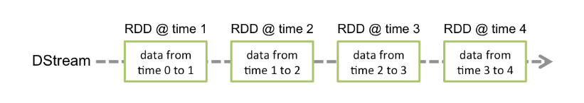
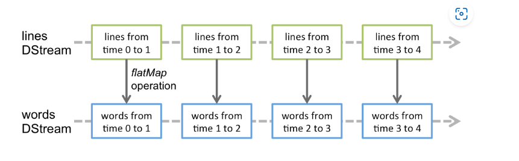
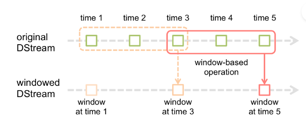

# Spark Streaming

## Streaming创建

```scala
//创建Conf，在shell中全局变量为sc
var conf=new SparkConf().setMaster("local[*]").setAppName("NetworkWordCount")
//创建streaming，在shell中全局变量为scc
val context = new StreamingContext(conf, Seconds(10))
//创建Streaming source
val line=context.socketTextStream("localhost",9999)
//设置computations
val words=line.flatMap(_.split(" "))
val pairs=words.map(word=>(word,1))
val wordCount=pairs.reduceByKey(_+_)
//存储（这里是打印）
wordCount.print()
//streaming开始接收消息
context.start()
//终止streaming
context.awaitTermination()

```

## Streaming 基本概念

### 初始化Spark StreamingContext

​	首先StreamingContext需要设置批处理延迟，涉及到性能瓶颈，参见性能调整。定义streaming  context后：

- 定义数据流源
- 定义计算操作
- 开始接收数据
- 等待处理停止
- 退出执行

​	重要的几点：

- streaming context一旦开始便无法向流中添加新的计算操作
- 一旦streaming停止便无法重新启动
- 同一个JVM同一时间只能存在一个StreamingContext
- stop()方法停止Spark的StreamingContext和SparkContext，如果只想停止StreamingContext可以设置stop的参数
- stop(false)，只停止了StreamingContext，因此，可以在之后重复利用SparkContext创建StreamingContext

### DStreams

​	第一：DStreams是Spark Streaming数据的抽象，是一个时间序列的数据流，它的数据源为数据源头或上一步得到的数据；

​	第二：DStreams代表一系列的RDDs（不可变的RDD）



​	                                                              经过转换后得到的DStream



### DStreams输入和接收

​	DStreams的输入源有很多：

- receiverStream可以自定义的Recevier接收的数据源
- socketTextStream、socketStream分别读取来自TCP的UTF8字符流和byte字节流
- rawSocketStream可以接收数据直接作为序列化块，可以直接推送到管理器而不用反序列化他们，**<u>这是接收数据最有效的方式</u>**
- fileStream可以接收文件流，文件来自HDFS。主要对于文件目录的监控有以下几点
  - 会处理某个目录下的所有文件
  - 可以在给定的参数中，用通配符
  - 所有的文件内容必须是相同格式的
  - 文件根据其修改时间作为时间段的一部分，而不是创建时间
  - 一旦处理完毕，就算文件更新了，也不会被重新读取
  - 目录下文件越多，扫描所用的时间越多
  - 重命名文件夹来匹配输入文件夹目录时，会将目录添加到监控目录列表中。修改时间时，也只有在windows中的目录才会被包含在流中
  - 使用 `FileSystem.setTimes()`更新时间戳，是一种window在之后重拾文件的方法
- textFileStream接收来自HDFS的文件作为UTF8字符流
- binaryRecordsStream接收来自HDFS的二进制文件流
- queueStream，RDD组成的队列
  - 测试使用，模拟一系列的数据流

- union将两个DStream连接起来

​	如果想要创建多个输入源也是可以的，如果这样做，需要为Spark Streaming程序分配更多的内核。

##### 切记

- 配置SparkConf中设置的master，如果是local运行，则需要设置成local[n]，n>接收器（Receiver）的数量
- 在集群中运行，分给Spark Streaming程序的core要多于Receiver的数量，否则程序只能接收数据，无法处理。

##### 使用对象存储数据

​	由于HDFS类似的文件系统对文件修改时间的修改机制，可能造成window错过更改，可能从流中省略数据。所以应将输出目录改为非监控的目录

##### 自定义Receiver

​	需要继承Receiver类，实现onStart（开始接收数据要做的事）和onStop（停止接收数据需要做的事情）方法。

- 这两个方法都不能是无限期阻塞的
- 通常情况下，onStart负责启动接收数据的线程，onStop方法会确保接收数据的线程被终止。接收线程可以使用isStoppted方法来确定，接收是否应停止接收数据
- 一旦接收数据，可以使用store方法存储在Spark内部。
- 在接收线程中任何异常都应该被捕获，以避免接收线程故障。
  - restart方法会通过异步调用onStop方法之后，延迟调用onStart方法以此重启接收器
  - stop方法将调用onStop方法终止接收器
  - reportError向驱动报告错误消息，而不停止/重启接收器

​	根据Receiver的可靠性和容错语义，有两种类型的接收器：

- 可靠接收器：对于发送的数据被确认的可靠源，可靠的R需要确认

  - 正确的接收了数据
  - 正确的将数据存储在了Spark中

  可靠的接收器实现起来很复杂

- 不可靠的接收器，收到数据不需要向源发送确认信息，他的实现相对简单很多

​	为了实现可靠的接收器，必须使用store来存储数据；store是阻塞式调用，只有所给定的记录被存储到spark才会返回。因此它确保了数据的可靠存储，接收器也可以在之后选择适当的确认源。

​	不可靠的接收器有以下优点：

- 系统将数据分成适当大小的块
- 如果制定了速率限制，系统会负责控制接收速率


### DStreams转换操作

|                                          |                                                              |
| ---------------------------------------- | ------------------------------------------------------------ |
| **map**(*func*)                          | 一个输入一个输出                                             |
| **flatMap**(*func*)                      | 可以产生0至n个输出                                           |
| **filter**(*func*)                       | 过滤操作                                                     |
| **repartition**(*numPartitions*)         | 通过增加或减少分区调整DStream并行度                          |
| **union**(*otherStream*)                 | 并集                                                         |
| **count**()                              | 通过计算DStreams中的每个RDD中元素的个数，返回一个新的单元素的RDD |
| **reduce**(*func*)                       | 类似RDD的Reduce操作，返回的是一个含有单一元素的RDD           |
| **countByValue**()                       | 返回一个新的<K,Long>对的DStreams，每个键的值是DStreams中每个RDD中出现的频率 |
| **reduceByKey**(*func*, [*numTasks*])    | 在<K,V>的DStreams上调用本方法，会将具有相同K的V应用func函数（注意本方法会使用默认并行度，本地模式为2，集群模式可以使用spark.default.parallelism指定） |
| **join**(*otherStream*, [*numTasks*])    | (K, V) and (K, W)-> (K, (V, W)) join操作                     |
| **cogroup**(*otherStream*, [*numTasks*]) | 聚合相同K的一系列的V和W(K, V) and (K, W) -> (K, Seq[V], Seq[W]) tuples. |
| **transform**(*func*)                    | 转换DStream中的RDD为另一个RDD                                |
| **updateStateByKey**(*func*)             | 看以下说明                                                   |

​	转换操作分为有状态和无状态操作，updateStateByKey就是有状态的操作。所谓的无状态是指，在上一个时间段的流数据的处理和下一个状态的流数据的处理没有关系。

### UpdateStateByKey Operation

​	这个操作允许在使用新到来的流数据时，同时保留状态（比如，一直统计订单数，就需要在一个一个的时间段连续不断的统计，同时需要有状态的统计，即需要将上一个时间段的统计结果保留，在下一个时间段时继续使用，并且累加统计）

​	这需要两个步骤：

- 定义状态
- 定义更新函数——即定义如何使用之前的state和现在的值更新state

```scala
def updateFunction(newValues: Seq[Int], runningCount: Option[Int]): Option[Int] = {
    val newCount = ...  // add the new values with the previous running count to get the new count
    Some(newCount)
}
```

**注意：使用这个函数 要设置检查点**

### Transform Operation

​	transform操作可以将底层的RDD拿出来操作

```scala
val spamInfoRDD = ssc.sparkContext.newAPIHadoopRDD(...) // RDD containing spam information

val cleanedDStream = wordCounts.transform { rdd =>
  rdd.join(spamInfoRDD).filter(...) // join data stream with spam information to do data cleaning
  ...
}
```

**注意：提供的函数操作会在每一批次中被调用。可以做时变的操作，例如RDD操作、分区数、广播变量**

### **<u>Window Operations</u>**

​	Spark提供窗口化计算，滑动窗口可以指定两个参数，一个数窗口大小，一个是滑动步长

- windows length：指的是包含多少批间隔，例如一批时间间隔为3，窗口长度必须指定为3的整数倍，如果是6，那么windows包含两个时间间隔（两批）
- siliding interval：滑动步长，一次滑动多少个时间间隔。（应该大于等于windows length，否则会有重复数据）



​		windows的所有操作必须的两个参数（Windows length，siling interval）

| Transformation                                               | Meaning                                                      |
| :----------------------------------------------------------- | :----------------------------------------------------------- |
| **window**(*windowLength*, *slideInterval*)                  | 创建windows                                                  |
| **countByWindow**(*windowLength*, *slideInterval*)           | count操作                                                    |
| **reduceByWindow**(*func*, *windowLength*, *slideInterval*)  | 类似DStream的reduce操作                                      |
| **reduceByKeyAndWindow**(*func*, *windowLength*, *slideInterval*, [*numTasks*]) | reduceByKey操作                                              |
| **reduceByKeyAndWindow**(*func*, *invFunc*, *windowLength*, *slideInterval*, [*numTasks*]) | 当滑动步长小于窗口大小时，出现重复数据，这个方法可以有效减少重复数据的重复计算，func为新数据的操作，invFunc为旧数据的删减 |
| **countByValueAndWindow**(*windowLength*, *slideInterval*, [*numTasks*]) | CountByValue                                                 |

### Stream-stream joins

```scala
val stream1: DStream[String, String] = ...
val stream2: DStream[String, String] = ...
val joinedStream = stream1.join(stream2)
```

可以进行left、right、fullOuter join操作，此外在streaming的windows上进行join操作非常有用

### Stream-dataset joins

```scala
val dataset: RDD[String, String] = ...
val windowedStream = stream.window(Seconds(20))...
val joinedStream = windowedStream.transform { rdd => rdd.join(dataset) }
```

 这是将RDD数据集与windows streaming连接起来的的另一个实例

### DStreams输出操作

​	输出有五种基本形式

- print，直接打印，用于调试

- saveAsTextFile：保存为文本文件

- saveAsObjectFiles：

- saveAsHadoopFiles：保存在HDFS上

- foreachRDD：遍历RDD，做其他操作

  ```scala
  dstream.foreachRDD { rdd =>
    val connection = createNewConnection()  // executed at the driver
    rdd.foreach { record =>
      connection.send(record) // executed at the worker
    }
  }
  ```

  对与DStream来说

  - DStream的输出操作也是延迟执行的，即没有输出操作，其他的运算操作也不会被执行。如果不执行输出操作，RDD就只会接收数据，然后简单的丢弃
  - 默认情况下，输出操作时一次性执行的

### 缓存数据和持久化 见RDD

​	对于有状态的操作，例如reduceByWindow、reduceByKeyAndWindow等有状态的操作，他们的持久化是隐式调用的。默认的DStreams持久化到内存

### 检查点

### Accumulators（累加器）、BroadCast Variable（广播变量）

### 应用部署


##### 升级代码、关闭Job

​	scc.stop方法关闭SparkContext，但是需要在一个线程中，单独的轮询。比如，读取监听一个端口，收到stop指令就停止

### 监控应用

## 性能调优

### 降低批处理时间

### 设置正确的时间间隔

### 内存调优

## 容错

