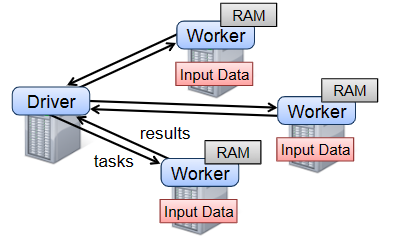
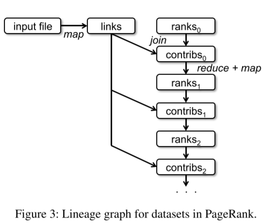
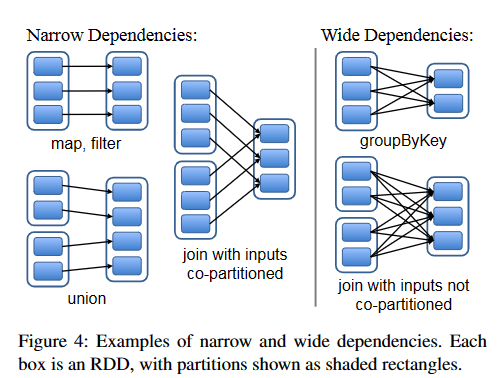
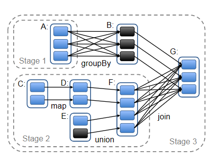

# RDD 弹性分布式数据集 抽象的高容错的分布式内存计算模型

## 摘要

RDD——弹性分布式数据集，这是一种分布式内存抽象，允许程序员以容错方式在大型集群上执行分布式计算。RDD擅长的两种计算模式：**<u>迭代式计算和交互式计算</u>**。这两种情况下：

- 将数据存放在内存中，将性能提高了一个数量级。
- 高容错：RDD提供了一种受限形式的共享内存，它基于对共享状态的**<u>粗粒度</u>**的转换，而不是细粒度更新。

## 1. 简介

### 1.1 问题

当前的分布式计算框架例如MapReduce、Dryad存在一个问题：数据复用的场景比较多（例如：PageRank，K-means，罗杰斯特回归），但是这些框架在**跨多次计算重用中间的结果效率低下**

HaLoop、Pregel虽然意识到上面提到的问题，但是像这两种框架也只是提供了一种隐式的数据共享，不能将多个数据集加载到内存。

### 1.2 解决方案

为了提供一种通用的编程接口，本文提出RDD：

- 对广泛使用的场景提供了一种**高效的数据复用**
- RDD是高容错的，用户可以将中间结果保存在内存中（cache方法），并以分区的方式优化数据的放置，使用一组丰富的运算符来操纵它们

### 1.3 主要问题

如何实现RDD的**高度容错**，是RDD模型的主要问题。

现有的DSM、K/V、数据库，他们都是**节点之间的数据复制，记录更新**。但是这样做的效率低下，会产生网络IO、存储开销，尤其是在CPU密集型任务，这种操作时十分昂贵的。

RDD提供的是一种基于粗粒度的内存转换操作，例如(map、filter、join)，将相同的操作应用于多个数据项。这中模型使它可以完成高度的容错机制，因为可以建立数据转换的关系图，如果出现RDD丢失，就根据关系图重新计算出RDD（RDD是有足够的信息使丢失的RDD通过重新计算获得）。

事实证明RDD这种粗粒度的计算模式很适合当前的集群模式的计算

## 2. RDD

### 2.1 RDD概述

首先RDD代表一些列的不可变的，有序的记录集合。RDD可以通过一些稳定存储的数据产生或从其他的RDD产生。我们可以对RDD进行一系列的转换操作。

第二点：RDD存储在内存中，但不是每一步的RDD都需要物化（计算出结果并缓存），代替的是——需要哪一步的计算结果，是可以通过一些信息知晓这一步的数据集是如何计算得到的。

第三点：用户可以控制RDD的两个方面，分别是：**<u>persistence & partition</u>**即持久化和分区。用户可以决定哪个RDD可以被persistence，以便于这一步的RDD（datasets）可以被重复使用。分区是一种很好的优化策略，可以将不同的分区划分进不同的节点，在做一些Hash-partition操作时是很有用的。

### 2.2 Programming Interface

每个数据集都代表一个对象，可以使用这个对象上的方法对数据集进行转换操作。

首先，程序员可以从一个稳定存储的数据进行转换得到一个RDD，这些操作最终可以将数据输出到存储系统、自定义输出、返回到源程序中。

注意Spark的计算是lazy的——只有用到数据时，才会触发计算，计算就像pipeline一样。

程序员还可以调用persistence方法持久化(持久化是有级别的)某些数据，以便后面的计算可以复用某一步骤的数据。Spark的默认持久化级别是RAM，如果没有足够的RAM，将会把数据溢出到磁盘。用户可以为每个RDD指定持久化级别。

### 2.3 Compare to DSM—> RDD 优缺点

| Aspect       | RDDs                      | DSM                              |
| ------------ | ------------------------- | -------------------------------- |
| 读           | 粗/细粒度                 | 细粒度                           |
| 写           | 粗粒度                    | 细粒度                           |
| 一致性       | RDD不可变（强一致性）     | 由程序/运行时决定                |
| 容错         | 细粒度、低开销（lineage） | 需要检查点和回滚                 |
| “掉队”的任务 | 启动备用任务（类似MR）    | 很困难                           |
| 工作空间     | 基于数据的局部性          | app决定                          |
| 内存溢出行为 | 类似于现有的数据流系统    | 性能很低（可能是交换内存的方式） |

DSM可以细粒度的控制到某个指定内存位置的读写，如果出现故障，DSM只能通过检查点恢复，那么开销也就会变大，而RDDs则可以通过世系图执行几步并行的操作，通过一个稳定存储的数据，再次得到失去的分区。而且DSM在解决“落后者”时，需要对数据共享的访问，造成内存争用开销，由于RDD的数据是不可变的，因此不存在内存争用问题。



### 2.4 局限性

RDD适用于批处理，将一批数据以一系列的相同操作进行处理（粗粒度）。而且RDD可以通过lineage graph记录每一步的转换操作，以此来实现容错而无需冗余数据。不适用于细粒度更新的应用程序。

## 3. Spark Programming Interface

详细见Spark RDD

### 3.1 逻辑回归和PageRank算法例子

##### 逻辑回归

​	

```scala
    val points = spark.textFile(...) 			              	.map(parsePoint).persist()
    var w = // random initial vector 
    for (i <- 1 to ITERATIONS) { 
        val gradient = points
            .map{ p => p.x * (1/(1+exp(-p.y*(w dot 						p.x)))-1)*p.y }
            .reduce((a,b) => a+b) 
        w -= gradient
    }
```


​	persist()方法将数据缓存至内存，可以提高运算速度（由于map操作是延迟的，调用persist才会执行，并将得到的结果缓存至内存）

##### PageRank

​	

```scala
val links = spark.textFile(...)
    .map(...).persist() 
var ranks = // RDD of (URL, rank) pairs 
for (i <- 1 to ITERATIONS) { // Build an RDD of (targetURL, float) pairs // with the contributions sent by each page 
    val contribs = links.join(ranks)
        .flatMap { (url, (links, rank)) => links.map(dest => (dest, rank/links.size))}
    // Sum contributions by URL and get new ranks 
    ranks = contribs.reduceByKey((x,y) => x+y) .mapValues(sum => a/N + (1-a)*sum)
}

```



- **对于中间结果ranks，需要在内存中进行一些复制，以确保在故障时快速恢复**

- **links数据集是不需要复制的，因为他可以通过map操作再次计算获得。即使links数据集丢失，计算数据结果要比节点之间复制数据快得多。**

- **可以控制RDD分区来优化通信，对links按URL跨节点进行hash散列分区，同样对ranks也进行hash散列，这样一来，就可以让分区内的links和ranks同时存在同一个节点，这样join操作就不会产生额外的通信开销。当然还可以自定义Partitioner类，将相互link的页面分到一个分区。上面的优化可以在定义分区时，调用partitionBy方法来实现**

  ```scala
  var links = spark.textFile(...).map(...) .partitionBy(myPartFunc).persist()
  ```

  

## 4. 表示RDDs

### 4.1 RDD的主要设计目标

**RDD的一个最大的挑战就是设计一种抽象可以跟踪transformation操作的世系图**。理想情况下，RDD可以提供一系列的转换操作和高级运算符，使用户可以任意的组合使用。

通过一个接口代表RDD，RDD中有五种可以被用户操作的信息：

- 一组分区，他是数据集的源自部分。
- 一组对父RDD的依赖(具体依赖的是父数据集上进行操作的函数、分区方案和数据放置的元数据(配置信息))。

### 4.2 RDD设计的一个重要问题

设计RDD最有趣的问题是**解决RDD之间的依赖关系**：




父子RDD的普通转换可能复杂度比较低，依赖度低(1->1,n->1映射)，多RDD的交并补差、join操作、分组可能涉及的操作比较复杂，这种操作的依赖度高(n->n的映射)。(依赖度的高低可以看作是数据在分区之间的映射，数据在不同的分区映射越多，依赖度就越高，反之，依赖度越低)

**依赖度会引发什么问题？**

依赖度低的，例如map、filter操作，数据可以在本机被以流式的方式处理，效率很高，遇到故障问题，恢复起来比较快，哪个节点数据丢失，就在哪个节点重新计算。相反，具有宽依赖(依赖度高)的计算方式，需要在不同节点之间交换数据，如果出现数据丢失，执行重新计算，可能会涉及多节点的重新计算，并且设计大量的网络IO。因此具有宽依赖的操作在故障恢复时成本较高。（<u>**这种情况有没有优化的方案呢？**</u>）

## 5. 实现

### 5.1 Job Scheduling



Spark的调度类似dryad，但是要额外考虑持久化RDD的哪些分区在内存中可用：

- 每当用户在RDD上运行操作，调度程序都会检查该RDD的lineage以构建要执行阶段的DAG
- 每个阶段都尽可能多的包含pipeline转换操作
- 阶段的界限是
  - 那些具有宽依赖特性的操作，因为这种操作可能涉及数据在不同节点的传输(shuffle)
  - 能够缩短父RDD计算的已计算分区
- 调度器会启动任务来计算每个阶段丢失的分区，直到它计算出目标RDD

也就是说，DAG的构建会尽可能多的包含map、filter这种操作，遇到类似join、union操作时，就不得不进行持久化操作，会计算出宽依赖操作的数据，并持久化。

**任务的分发**

- 调度程序使用延迟计算（调度）的策略，按照数据局部性将任务分配给节点（也就是数据在哪个节点就在那个节点上执行任务，这样可以避免过多的网络IO）。如果任务需要处理节点内存中的一个分区，就将任务发送到该节点。
- 对于依赖度高（宽依赖）的操作，调度器会物化（缓存）父操作产生的中间结果（shuffle结果，比如join操作的中间结果）用于简化故障恢复。
- 如果一个节点上的任务失败，只要这个步骤的父操作依然可以获得，我们可以通过在其他节点重新执行任务即可获得。但是如果某阶段不可用（丢失了某些操作：map、filter），那没办法，只能将任务重新提交以计算出丢失的分区。（丢失数据可以重新计算，丢失的是操作，那么DAG lineage就不完整，就只能重新获取任务）
- 尽管赋值RDD的lineage很简单，但是不能容忍程序级别的错误。

### 5.2 Spark shell

### 5.3 Memory management

Spark提供了三种可选择RDD序列化的方式：

- 作为Java反序列化对象存储在内存
- 作为序列化的数据存储在内存
- 作为序列化的数据存储在磁盘

显而易见，第一个选择的性能最高，第二个选择比第一个节省一些内存空间，当然数据需要被反序列化为Java 对象才可以被使用，所以性能相对第一个较低。第三个选择适用于RDD太大而无法保存在RAM中且每次计算成本高。

为了有效的管理可用内存，Spark使用LRU策略对RDD进行逐出。在计算一个新的RDD时，如果没有足够的内存使用，就寻找一个最近最少访问的RDD逐出，当然这个被逐出的RDD与具有新分区的RDD是不同的。如果发现将要被逐出的RDD与新分区的RDD相同，我们将旧的分区保存，防止抖动。Spark还提供了持久化的优先级策略进一步控制内存的使用。

### 5.4 Checkpoints

尽管lineage对恢复rdd比较容易，但是对于较长的操作（map.flatmap.filter....），并且操作具有宽依赖性,这种操作可能会很耗时。因此，对RDD做一些检查点操作对RDD的稳定存储就显得有必要了。

很容易想到，检查点对于较长的操作比较适用，例如Page-rank。在这种情况下，集群节点的故障可能会导致每个父RDD都丢失一些数据片段，就要重新计算。使用checkpoint会将RDD运算结果存储在HDFS上，就不需要重新计算了。

而对于较短的、窄依赖性的操作，检查点所付出的代价就显得不值得了，例如逻辑回归。这种情况就只需要简单的重计算就可以了。

至于如何使用checkpoint就交给用户。研究人员也在研究，如何实现自动执行最优的检查点，因为调度器知道每个数据集的大小以及首次计算它花费的时间，所以它应该能选择出一组最佳的RDD作为检查点，以此来最小化系统恢复时间。

最后，对于Spark的RDD，因为RDD是不可变的，因此不需要担心分布式内存的一致性问题，而且RDD可以在后台写出，而不需要程序暂停或分布式快照方案。


## 6. 评估

使用Amazon EC2做了一系列的基准测试，结果表明：

- 在迭代机器学习和图形应用程序中，Spark 的性能比 Hadoop 高出 20 倍。加速来自通过将数据作为 Java 对象存储在内存中来避免 I/O 和反序列化成本
- 我们的用户编写的应用程序性能和扩展性都很好。特别是，我们使用 Spark 将在 Hadoop 上运行的分析报告加速了 40 倍
- 当节点出现故障时，Spark 可以通过只重建丢失的 RDD 分区来快速恢复
- Spark 可用于以 5-7 秒的延迟以交互方式查询 1 TB 数据集

### 6.1 迭代式机器学习应用

### 6.2 PageRank

### 6.3 故障恢复

## 7. 讨论

RDD的不可变和粗粒度操作内存的特性，似乎提供了一种受限的编程接口，但是其实RDD适用于很多的编程模型。例如：

- MapReduce：使用map\flatmap\reduce\groupby函数
- DryadLINQ：类似MapReduce
- SQL：SparkSql
- Pregel：
- 迭代式MapReduce
- Spark Streaming

## 8. 相关工作

**集群编程模型**

首先RDD代表了比稳定存储更有效的数据共享抽象，而且尽量的避免了数据复制、IO和序列化的成本。

Spark作为RDD的实现，提供了一系列的流式处理的API编程模型。

RDD 显式地提供分布式存储抽象，因此可以支持这些专用系统无法捕获的应用程序，例如交互式数据挖掘。

**缓存系统**

Nectar 可以通过程序分析识别常见的子表达式，在 DryadLINQ 作业中重用中间结果。RDD加入了额这种很棒的特性。但是Nectar不支持内存缓存，也不允许用户显式的控制要保留哪些数据集以及如何对它们分区。Ciel、Flume都提供缓存任务结果，但不提供内存缓存或缓存哪些数据的显式控制。

Ananthanarayanan等人已经提议向dfs添加内存缓存以利用数据访问的时间和空间局部。但它在应用程序中共享中间结果的方式不如RDD有效，因为仍然需要应用程序将这些结果写入文件系统阶段。


**Lineage**

捕获数据的沿袭和出处一直都是科学计算和数据库的研究课题。用于解释结果、允许其他人重现工作流程中发现的错误或错误时重新计算数据等应用。RDD使用lineage作为容错的机制，利用并行计算的优势，大大的减少磁盘IO。

**关系型数据库**

RDD在概念上类似关系型数据库的视图View，持久化的RDD类似于物化视图。这就决定了RDD对一致性有着天生的优势，它不必浪费更多的开销来维护分布式内存的一致性。

## 9. 结论

Spark作为RDD模型的一种实现，它具有高效、通用和容错的特点。性能比Hadoop高出20倍。

